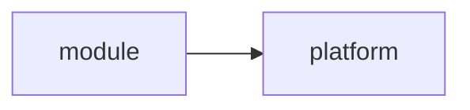

A live entry. All entries: [the index](/enhancements/). How it relates to others: [the relationship graph](/enhancements/graph/).

## How it works

The design is in [the design document](/enhancements/0001/design/), and its first decision is
[D1](/enhancements/0001/decisions/#d1). It extends [the archived entry](/enhancements/0002/), its
schema is [target.cue](https://github.com/open-platform-model/enhancements/blob/eddf92c16f02dddf146a6068b38a6ae03f1c4f77/0001/schemas/target.cue), and its schemas live in
[schemas/](https://github.com/open-platform-model/enhancements/tree/eddf92c16f02dddf146a6068b38a6ae03f1c4f77/0001/schemas). The docs explain [the start section](/docs/start/).
Its decisions are in [0001: Decisions](/enhancements/0001/decisions/).

| ID | Status |
| -- | ------ |
| 0001 | draft |
