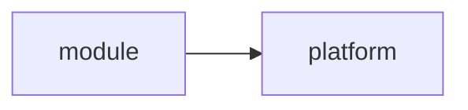

# Enhancement 0001: Fixture Live Entry

<!-- quokkabrief: a planning comment the build must strip. -->

A live entry. All entries: [INDEX.md](../INDEX.md). How it relates to others: [GRAPH.md](../GRAPH.md).

## How it works

The design is in [the design document](02-design.md), and its first decision is
[D1](03-decisions.md#d1). It extends [the archived entry](../archive/0002/), its
schema is [target.cue](schemas/target.cue), and its schemas live in
[schemas/](schemas/). The docs explain [the start section](/docs/start/).
Its decisions are in [03-decisions.md](03-decisions.md).

| ID | Status |
| -- | ------ |
| 0001 | draft |
